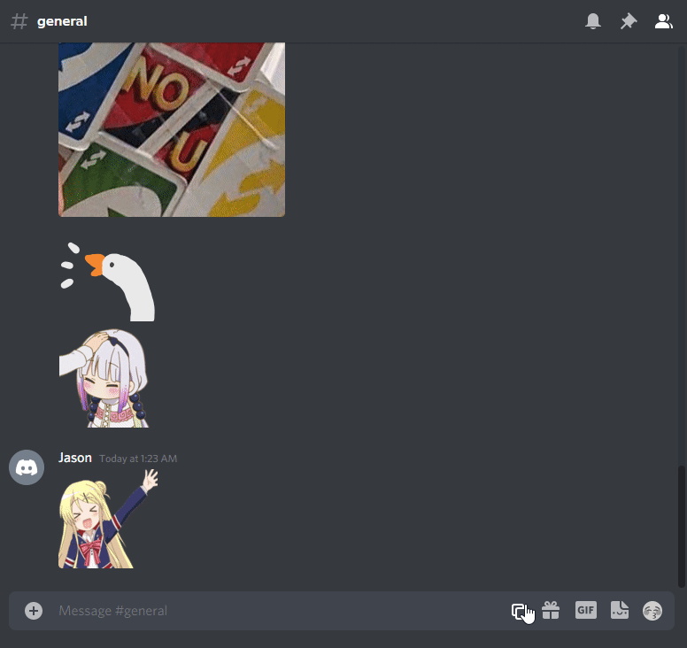

# Costello

Save and send a collection of images right inside Discord.

## Install

1. Install [BetterDiscord](https://betterdiscord.app/).

   > ⚠️ **IMPORTANT** ⚠️ Installing and using BetterDiscord violates Discord's
     terms of service. Visit [BetterDiscord's FAQ](https://betterdiscord.app/FAQ)
     for more details.

2. [Download](https://github.com/jasonliang-dev/costello/releases/download/v0.0.4/costello.plugin.js)
   the latest release of Costello

3. Move the file into the plugins folder. If you're on Windows, the
   plugins folder should be `%appdata%\BetterDiscord\plugins`

4. In Discord > User Settings > Plugins (near the bottom), Enable Costello.

## Usage

1. Click on the new icon in the text message area, then click on
   Add/Remove Stickers.

   > You can open the menu with `Control + Shift + X`

2. Copy and paste an image link (or several links, separated by
   spaces) into the text area at the top. Click Add, or hit enter.

3. Change the names of each image to your liking. Click Back.

4. Then click on an image to send it. You can use the search bar to
   filter images by name.

   > Hitting enter when the search bar is focused will send
     the first image in the list.

5. 🎉 yay 🎉
